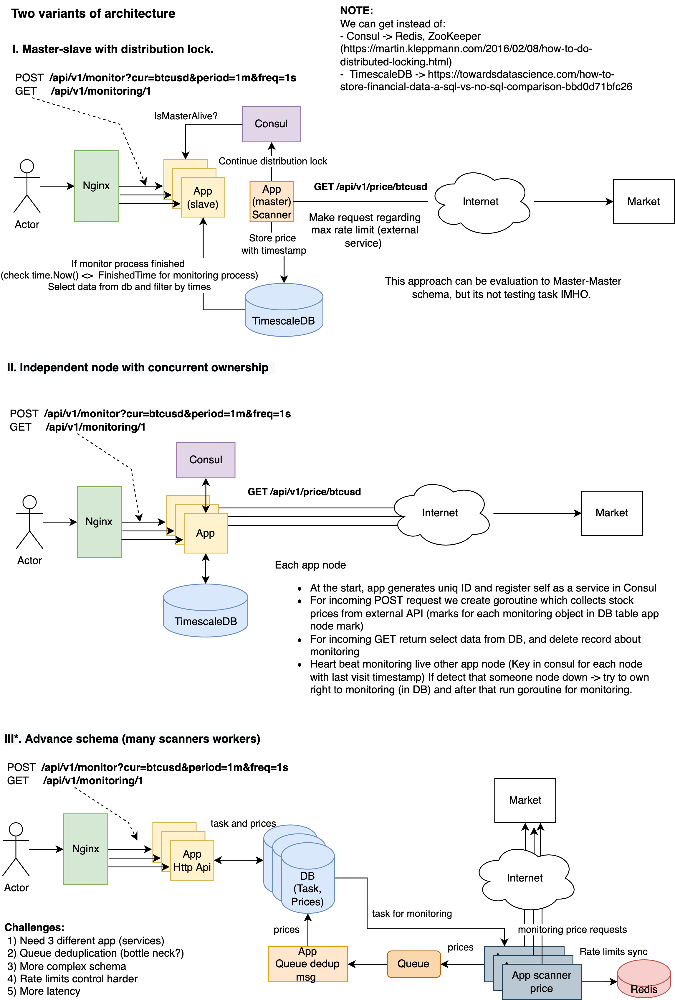
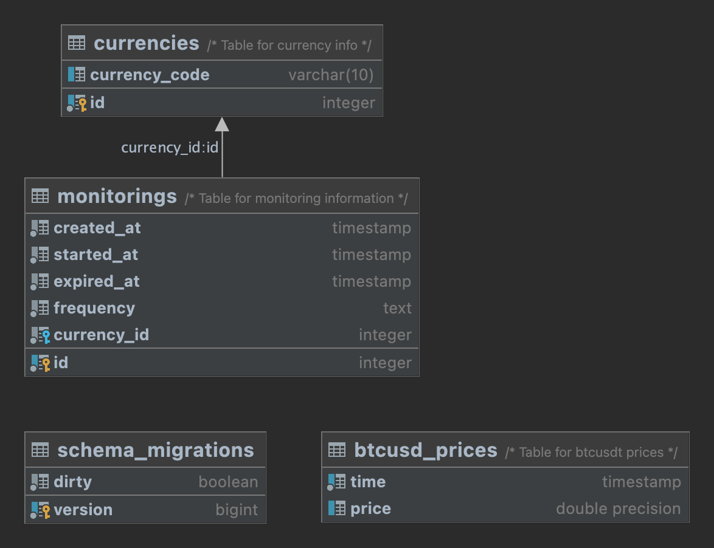

# Price monitoring
The test task. Creating a tiny service which allows to monitor Bitcoin prices over a specified period of time with specified frequency.

## Task
The task is it to create a tiny service which allows to monitor Bitcoin prices over a specified period of time with specified frequency. For example a user
sends a request to the service to monitor Bitcoin price for a period of 5 minutes with frequency every 10 seconds. User is assumed to be able to do 2 operations:
1. Call the service with period and frequency parameters, which will start monitoring. Returns monitoring ID. A user can start many monitors in parallel without waiting for previous monitors to finish.
2. Call the service with monitoring ID to check if monitoring is complete and to get results (if monitoring is not finished yet, return some kind of error).


## Solution


#### Main architecture diagram




I have chosen first approach.


ERP 



## Before please install this 

1) [Docker and Docker Compose](https://docs.docker.com/compose/install/)
2) Be sure that your system support Makefile [more_info](https://askubuntu.com/questions/161104/how-do-i-install-make)
3) Optional Go (for local development) [Go install](https://go.dev/doc/install)

#### Run 

From root of the repository:

    make start 


#### Stop

    make stop


#### How to make requests

1) Health check 

     ```curl --request GET --url http://localhost:4000/health```

2) Start monitoring

    ```curl --request POST --url http://localhost:4000/api/v1/monitoring?period=1m&freq=10s```

3) Get results of monitoring 

    ```curl --request GET --url http://localhost:4000/api/v1/monitoring/1```


TODOS:
Refactor a little bit
1) Implement hexagonal-architecture ->  https://medium.com/@matiasvarela/hexagonal-architecture-in-go-cfd4e436faa3
2) Increase test coverage
3) Add more errors handlers 
4) 
